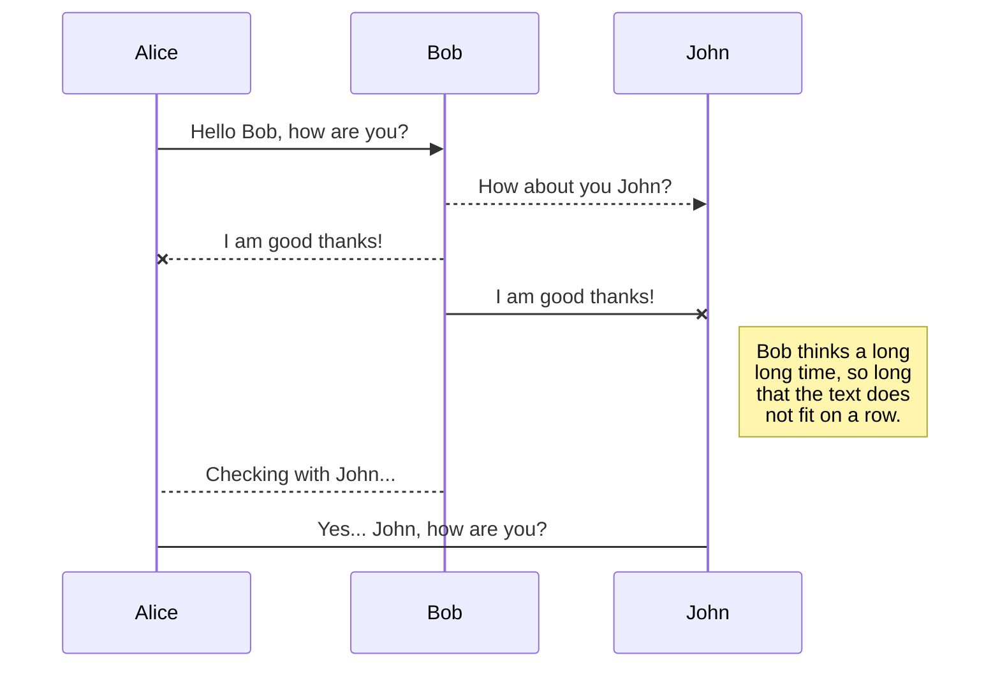
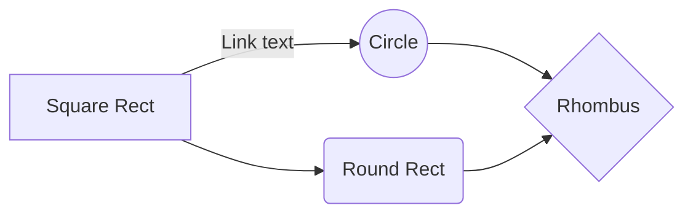

# Pet Shop

  

Descripción de las rutas implementadas para el proyecto.

  

# Routes

  

1. /contact

2. /products

3. /profiles

4. /sales

5. /users

  

# Descripción

  

## 1. /contact

  

Ruta implementada para el envío y almacenamiento de consultas.

***Método GET(admin):***

Permite obtener un listado (array) con todas las consultas enviadas a la web.

**response:**

```

[
	{
		"_id": "5e286072b2db5e230c1300de",
		"email": "hans@test.com",
		"body": "Este es un mail de prueba",
		"__v": 0
	},
	{
		"_id": "5e28608cb2db5e230c1300df",
		"email": "hans@test.com",
		"body": "Este es un mail de prueba2",
		"__v": 0
	},
	{
		"_id": "5e28608eb2db5e230c1300e0",
		"email": "hans@test.com",
		"body": "Este es un mail de prueba3",
		"__v": 0
	}
]

```

***Método POST:***

Utilizado para el envío en sí del mensaje.

**Body:**

```
{
	email: {
		type: String,
		required: true
	},
	body: {
		type: String,
		required: true
	}
}
```

  

## 2. /products  
  Ruta implementada para la administración y compra venta de productos de la empresa. Contiene métodos abiertos y métodos asegurados para uso exclusivo del administrador.
  
  ***Método GET:***
  Parámetros de paginación:
 1. page: Indica la página de productos que se desea obtener.
 2. quantity: Cantidad de productos que serán listados por página.

Ejemplo:

/products?page=1&quantity=2

**Response:**
```
{
    "result": [
        {
            "_id": "5e25f4248253b346ecdb6ee7",
            "name": "Cuchasa",
            "description": "Verde",
            "price": 200,
            "stock": 100,
            "__v": 0
        },
        {
            "_id": "5e260cd32c1e8246c4755027",
            "name": "cuerda",
            "description": "roja",
            "price": 100,
            "stock": 96,
            "__v": 0
        }
    ],
    "currentPage": 1,
    "totalPages": 3,
    "total": 5,
    "quantity": 2
}
```
Si ningún parámetro es enviado, se obtendrán los primeros 10 productos de la base de datos.
```
{
    "result": [
        {
            "_id": "5e25f4248253b346ecdb6ee7",
            "name": "Cuchasa",
            "description": "Verde",
            "price": 200,
            "stock": 100,
            "__v": 0
        },
        {
            "_id": "5e2f1f43becd02235c90d518",
            "name": "Pelota",
            "description": "Roja",
            "price": 200,
            "stock": 200,
            "__v": 0
        },
        {
            "_id": "5e344eac886d9f23b86b1949",
            "name": "Test",
            "description": "Verde",
            "price": 200,
            "stock": 100,
            "__v": 0
        },
        
    ...

	]
    
    "currentPage": 1,
    "totalPages": 1,
    "total": 10,
    "quantity": 10
}
```
***Método POST (admin):***
  Permite agregar un nuevo artículo a la DB.
  
  **Body:**
```
{
	name: {
		type:  String,
		required:  true
	},
	description: {
		type:  String,
		required:  false
	},
	price: {
		type:  Number,
		required:  true
	},
	stock: {
		type:  Number,
		required:  true
	}
}
```
***Método PUT (admin):***
Permite modificar un producto de la base de datos. El ID del producto debe ser enviado por query param.
Ejemplo:
/products?id=iddelproducto

Los campos a editar deben estar contenidos en el body de la petición. Se debe prestar cuidado a no enviar campos vacíos con tal de evitar actualizaciones erróneas del producto.  

***Método DELETE (admin):***
Permite eliminar un producto de la base de datos. El ID del producto debe ser enviado por query param.
Ejemplo:
/products?id=iddelproducto

**Response:**
```
{
    "n": 0,
    "ok": 1,
    "deletedCount": 0
}
```
## 2. /sales  
Ruta implementada para la venta de artículos y su registro en la DB.
Para acceder a la ruta se debe estar logueado en la web.

***Método POST (logged):***
La ruta acepta un array de productos indicando el ID del producto correspondiente y la cantidad del artículo a comprar.
  **Body:**
```
{
	"products": [
		{
			"productId": "testId1234",
			"quantity": 4
		},
		{
			"productId": "testId1235",
			"quantity": 2
		}
	]
}
```

## Delete a file

  

You can delete the current file by clicking the **Remove** button in the file explorer. The file will be moved into the **Trash** folder and automatically deleted after 7 days of inactivity.

  

## Export a file

  

You can export the current file by clicking **Export to disk** in the menu. You can choose to export the file as plain Markdown, as HTML using a Handlebars template or as a PDF.

  
  

# Synchronization

  

Synchronization is one of the biggest features of StackEdit. It enables you to synchronize any file in your workspace with other files stored in your **Google Drive**, your **Dropbox** and your **GitHub** accounts. This allows you to keep writing on other devices, collaborate with people you share the file with, integrate easily into your workflow... The synchronization mechanism takes place every minute in the background, downloading, merging, and uploading file modifications.

  

There are two types of synchronization and they can complement each other:

  

- The workspace synchronization will sync all your files, folders and settings automatically. This will allow you to fetch your workspace on any other device.

> To start syncing your workspace, just sign in with Google in the menu.

  

- The file synchronization will keep one file of the workspace synced with one or multiple files in **Google Drive**, **Dropbox** or **GitHub**.

> Before starting to sync files, you must link an account in the **Synchronize** sub-menu.

  

## Open a file

  

You can open a file from **Google Drive**, **Dropbox** or **GitHub** by opening the **Synchronize** sub-menu and clicking **Open from**. Once opened in the workspace, any modification in the file will be automatically synced.

  

## Save a file

  

You can save any file of the workspace to **Google Drive**, **Dropbox** or **GitHub** by opening the **Synchronize** sub-menu and clicking **Save on**. Even if a file in the workspace is already synced, you can save it to another location. StackEdit can sync one file with multiple locations and accounts.

  

## Synchronize a file

  

Once your file is linked to a synchronized location, StackEdit will periodically synchronize it by downloading/uploading any modification. A merge will be performed if necessary and conflicts will be resolved.

  

If you just have modified your file and you want to force syncing, click the **Synchronize now** button in the navigation bar.

  

>  **Note:** The **Synchronize now** button is disabled if you have no file to synchronize.

  

## Manage file synchronization

  

Since one file can be synced with multiple locations, you can list and manage synchronized locations by clicking **File synchronization** in the **Synchronize** sub-menu. This allows you to list and remove synchronized locations that are linked to your file.

  
  

# Publication

  

Publishing in StackEdit makes it simple for you to publish online your files. Once you're happy with a file, you can publish it to different hosting platforms like **Blogger**, **Dropbox**, **Gist**, **GitHub**, **Google Drive**, **WordPress** and **Zendesk**. With [Handlebars templates](http://handlebarsjs.com/), you have full control over what you export.

  

> Before starting to publish, you must link an account in the **Publish** sub-menu.

  

## Publish a File

  

You can publish your file by opening the **Publish** sub-menu and by clicking **Publish to**. For some locations, you can choose between the following formats:

  

- Markdown: publish the Markdown text on a website that can interpret it (**GitHub** for instance),

- HTML: publish the file converted to HTML via a Handlebars template (on a blog for example).

  

## Update a publication

  

After publishing, StackEdit keeps your file linked to that publication which makes it easy for you to re-publish it. Once you have modified your file and you want to update your publication, click on the **Publish now** button in the navigation bar.

  

>  **Note:** The **Publish now** button is disabled if your file has not been published yet.

  

## Manage file publication

  

Since one file can be published to multiple locations, you can list and manage publish locations by clicking **File publication** in the **Publish** sub-menu. This allows you to list and remove publication locations that are linked to your file.

  
  

# Markdown extensions

  

StackEdit extends the standard Markdown syntax by adding extra **Markdown extensions**, providing you with some nice features.

  

>  **ProTip:** You can disable any **Markdown extension** in the **File properties** dialog.

  
  

## SmartyPants

  

SmartyPants converts ASCII punctuation characters into "smart" typographic punctuation HTML entities. For example:

  

| |ASCII |HTML |

|----------------|-------------------------------|-----------------------------|

|Single backticks|`'Isn't this fun?'` |'Isn't this fun?' |

|Quotes |`"Isn't this fun?"` |"Isn't this fun?" |

|Dashes |`-- is en-dash, --- is em-dash`|-- is en-dash, --- is em-dash|

  
  

## KaTeX

  

You can render LaTeX mathematical expressions using [KaTeX](https://khan.github.io/KaTeX/):

  

The *Gamma function* satisfying $\Gamma(n) = (n-1)!\quad\forall n\in\mathbb N$ is via the Euler integral

  

$$

\Gamma(z) = \int_0^\infty t^{z-1}e^{-t}dt\,.

$$

  

> You can find more information about **LaTeX** mathematical expressions [here](http://meta.math.stackexchange.com/questions/5020/mathjax-basic-tutorial-and-quick-reference).

  
  

## UML diagrams

  

You can render UML diagrams using [Mermaid](https://mermaidjs.github.io/). For example, this will produce a sequence diagram:

  



  

And this will produce a flow chart:

  

